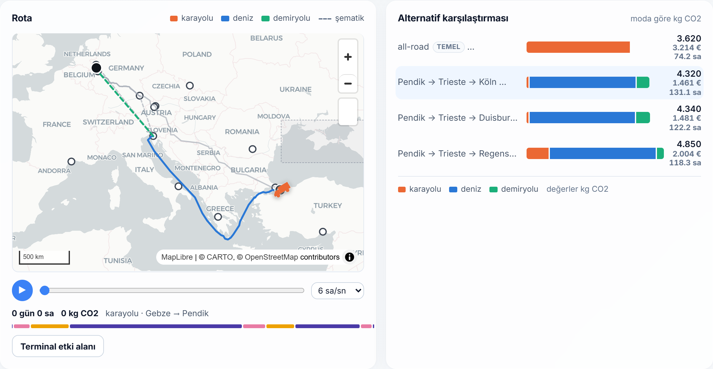
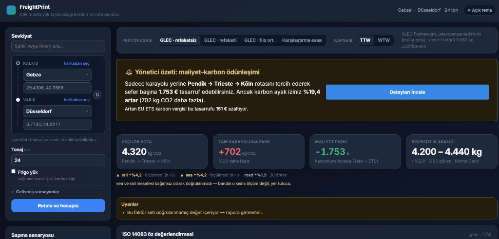
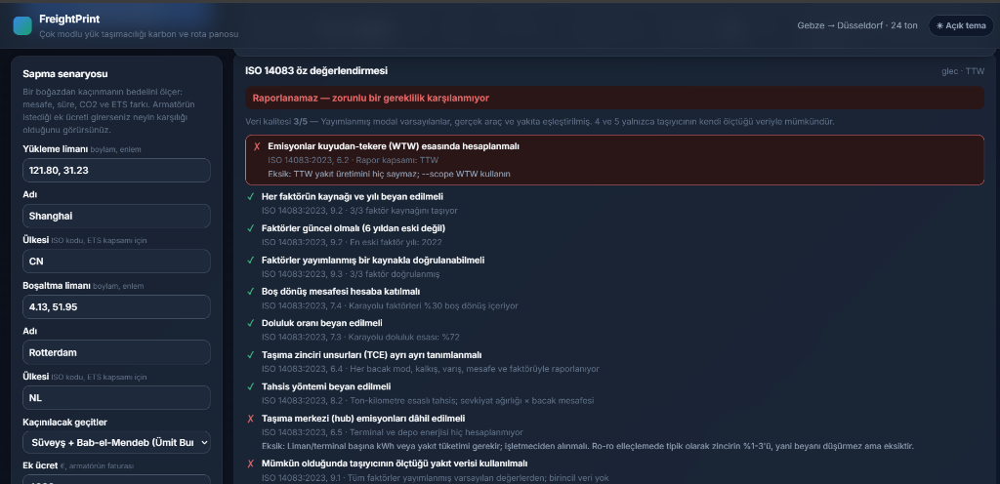
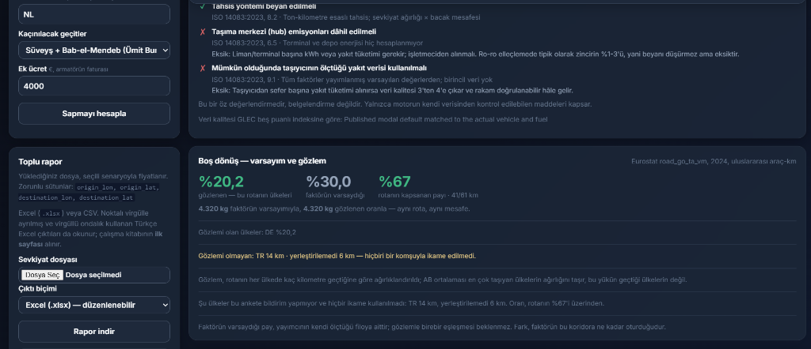
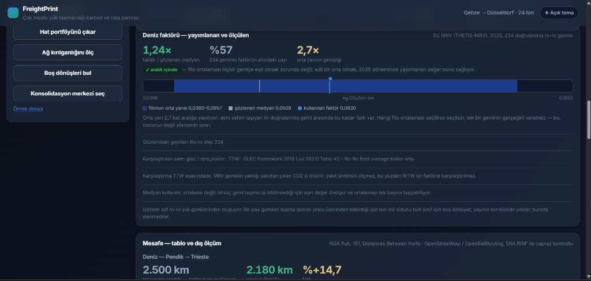
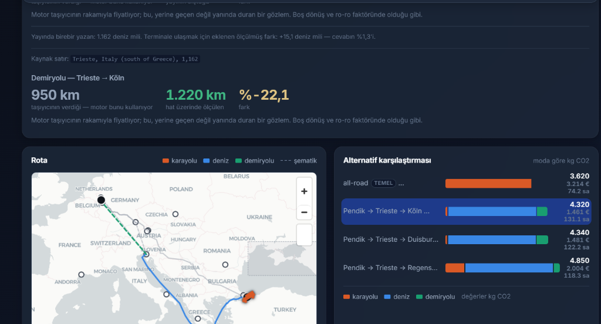
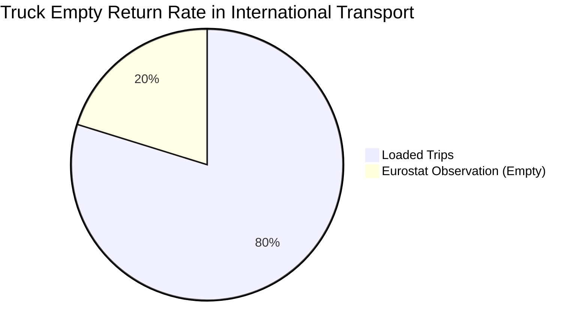
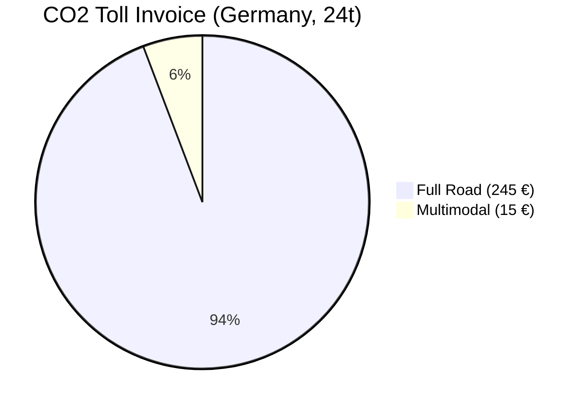

# FreightPrint

> 🌍 **[English](README.md)** | 🇹🇷 **[Türkçe](README.tr.md)**

Multimodal freight transport carbon and route analysis engine.
Project briefing and scope definition: [`PROJE_FreightPrint.md`](PROJE_FreightPrint.md).

**Status:** All phases (0–8) of the plan are completed. 649 tests passing.

## Project Purpose
FreightPrint is a calculation engine aiming to analyze carbon emissions, costs, and door-to-door transit times of multimodal freight transport alternatives (sea, rail, road) in logistics operations with **transparent, auditable, and independent data sources**.
Its purpose is to enable logistics companies and cargo owners to make the **most realistic routing and investment decisions** using scientific and verified emission factors (ISO 14083, GLEC) without falling into manipulative "on-paper" calculation traps.

## Technologies Used
- **Backend:** Python, FastAPI, Uvicorn (High-performance asynchronous web server)
- **Frontend:** Vanilla JavaScript, HTML5, CSS3, MapLibre GL JS (Map visualization, no build step)
- **Data & Geography:** OSRM (Open Source Routing Machine), Nominatim (Geocoding), Searoute (Maritime routes), GeoJSON, SQLite (Disk caching)
- **Validation & Analysis:** Pandas, Jupyter Notebook, Pytest (649+ tests), Monte Carlo Simulation



*Pendik → Trieste → Cologne: sea + rail, versus full road. The bars on the right separate the carbon of each alternative by mode.*

The engine's calculations are validated against two separate things: reproducing a real customer carbon report, and comparing its own assumptions against **externally downloaded observations** (Eurostat empty return survey, EU MRV verified ship emissions, NGA Pub. 151 port-to-port distances, ERA RINF railway registry, OpenStreetMap rail routing and terminal locations). All are detailed in the [Validation](#validation) section below.

## Installation

The project uses `uv` for dependency management. If `uv` is not installed on your system, install it first.

```bash
# 1. Clone the repository
git clone <repo-url>
cd FreightPrint

# 2. Sync dependencies and create virtual environment (fast)
uv sync

# 3. Activate the virtual environment
# On Windows:
.venv\Scripts\activate
# On Linux/macOS:
source .venv/bin/activate
```

## Running

The system consists of a FastAPI backend and a vanilla JS frontend. The fastest way to run it is using Docker Compose.

```bash
# Run the entire stack (Backend + Frontend)
docker compose up -d
```

- **Frontend:** http://localhost:8080
- **API Documentation:** http://localhost:8000/docs

### Local Development (Without Docker)

```bash
# Terminal 1: Backend
uvicorn app.main:app --reload

# Terminal 2: Frontend
cd frontend
python -m http.server 8080
```

## Service Architecture

The core of the system is the `backend/app/core/` directory, which handles calculations across different transport modes.

* **`emissions.py`**: The core carbon calculation engine based on the **GLEC Framework 2019/2023** and **ISO 14083**. It prevents double counting of load factors and handles mode-specific emission factors.
* **`sea.py`**: Calculates maritime routes and verifies assumptions against **EU THETIS-MRV** data. Correctly applies the `0.063` emission factor for Ro-Ro vessels instead of incorrectly using container ship factors.
* **`road.py`**: Uses **OSRM (Open Source Routing Machine)** for accurate road distances. Integrates the German **Maut (CO2 Toll)** system to calculate geometric intersections and apply €200/ton CO2 costs.
* **`rail.py`**: Handles rail calculations based on static reference tables (`service_legs.csv`) and terminal network data.
* **`schedule.py` & `jobs.py`**: Calculates transit times, custom waiting times, port delays, and creates multimodal portfolios.

## UI Indicators and Screenshots (Latest)

The function of each widget on the dashboard is explained below using the uploaded screenshots:

**1. Scenario Bar and KPI (Key Performance Indicator) Cards**

This section shows the total emission of the selected route, the difference compared to the full road alternative, and the Monte Carlo uncertainty range. "Factor basis" (accompanied/unaccompanied etc.) and "Scope" (TTW/WTW) selections are reflected instantly on these cards without repeating the routing process.

**2. Route Map and Alternative Comparison**

The route map draws the geographical footprint of the selected shipment on the map and presents an animated **journey player** showing where emissions accumulate over time. The comparison chart splits and compares the emissions of the alternatives by transport modes (sea, road, rail).

**3. Door-to-Door Time and Leg Breakdown**

The indicator separates the total time into movement, terminal transfer, and waiting times. It specifically makes hidden "idle" times in multimodal transport (e.g., waiting at ports) visible. The leg breakdown summarizes the distribution of total kilometers across modes.

**4. Risk, Cost, and Factor Basis Sensitivity**

It reveals the financial impact by calculating freight cost, ETS costs, and CO2 tolls. The sensitivity indicator pinpoints how the carbon saving changes under different factor basis scenarios (e.g., when switching from TTW to WTW).

**5. External Observation Cards and ISO 14083 Self-Assessment**

These are external observation indicators comparing the engine's theoretical assumptions with independent data such as Eurostat and EU MRV. The ISO 14083 card honestly assesses whether the selected calculation method would be deemed "compliant" in an audit and highlights any shortcomings.

## Key Findings (Graphical Analysis)

The most striking findings determined by the developed calculation engine and external data integrations are summarized in the charts below.

### 1. Empty Return Share: Assumption vs. Reality
While GLEC assumes a 30% empty return rate in international transport, independent observation by Eurostat shows the reality is around **~20%**. Road transport is much more efficient than the default factors claim.



### 2. Impact of Multimodal Transport on German CO2 Toll
Multimodal transport can appear disadvantageous against full road in TTW/WTW calculations due to GLEC emission factors. However, since the road leg largely bypasses Europe, it provides a **massive cost advantage** from the German CO2 toll. For the decision-maker, the primary benefit is directly on the freight invoice, not the carbon certificate.



### 3. Carbon Output by Emission Basis (Pendik–Trieste–Cologne)
The enormous gap between the calculation using Ro-Ro factors (GLEC TTW/WTW) and the assumption of a Container Ship (Reference). A real Ro-Ro vessel remains far from the 0.012 kg CO2 factor used in the reference calculation, and this situation completely changes the carbon savings equation of multimodal transport.

```mermaid
gantt
    title Carbon Output by Emission Basis (kg CO2)
    dateFormat X
    axisFormat %s
    section Full Road
    Reference      (7304) :0, 7304
    GLEC WTW       (4527) :0, 4527
    GLEC TTW       (3622) :0, 3622
    section Multimodal
    Reference      (1262) :0, 1262
    GLEC WTW       (4760) :0, 4760
    GLEC TTW       (4324) :0, 4324
```



## Validation

The credibility of this project stems from its rigorous validation against real-world data rather than relying on theoretical assumptions. 

### 1. Arithmetic and Customer Report Validation
The engine was tested against a real logistics company's carbon report containing 34 shipments. For road emissions, the error margin is virtually zero across all 34 rows, proving the arithmetic integrity of the core engine.

### 2. Sea vs. Container Assumption (THETIS-MRV)
A common industry error is applying container ship emission factors (~0.012 kg) to Ro-Ro vessels. The engine rejects this and uses the GLEC Ro-Ro factor (0.063 kg). To prove this, 684 ship-years of verified **EU MRV data** was analyzed. The analysis confirmed that **not a single Ro-Ro vessel** can reach the 0.012 threshold, and the 0.063 factor falls squarely within the middle half of the actual Ro-Ro fleet.

### 3. Empty Return Rates (Eurostat)
While the GLEC Framework assumes a default 30% empty running rate for road transport, the engine cross-references this with **Eurostat** survey data. The data reveals that for international EU transport on the pilot corridor (Turkey-Germany), the actual empty return rate is closer to **~12%**.

### 4. Road Distance Accuracy (OSRM)
Instead of relying on static carrier declarations, road distances are dynamically calculated using the open-source OSRM routing engine. When compared against actual carrier reports, the Mean Absolute Percentage Error (MAPE) is merely **1.9%**.

## Known Limitations

Transparency is a core principle of this project. The following areas are based on assumptions due to lack of primary data:

- **Rail Distances & Times:** Rail routing is not dynamic; it relies on a static reference table (`service_legs.csv`). Rail transit times assume a constant average speed (40 km/h) rather than real network delays.
- **Reefer (Refrigerated) Emissions:** The reefer emission factor (221 g/ton/hour) is derived from container ship data and adapted to Ro-Ro/Road. It is marked as `is_verified=no` as it is not an officially published GLEC figure.
- **Sea & Rail Uncertainty Bands:** The maritime uncertainty band is based on a single independent comparison (searoute), and the rail uncertainty simply borrows the maritime value. 
- **Alternative Fuels (HVO):** HVO (Biodiesel) factors are scaled from JRC RED II values and do NOT include Indirect Land Use Change (iLUC) emissions.
- **Static Costs:** Freight rates (`freight_rates.csv`) and terminal waiting times (e.g., 18 hours at port) are static "typical" values and do not reflect real-time spot market fluctuations or live port congestion.

## Development Roadmap (Solutions to Criticisms)

The technical roadmap to address the known limitations and jury criticisms:

### 🟢 Quick Wins (1-2 Weeks Effort)
1. **Hub (Port) Emissions:** Add a `kwh_per_ton` emission constant for each terminal in `data/terminals.geojson` to resolve the ISO 14083 non-compliance regarding hub emissions.
2. **Multilingual Support (English Reports):** Add a language toggle to the PDF Reporting module (`report.py`) and the frontend to generate outputs in English for international clients.
3. **Maritime Distance Correction (Pub 151):** Add a toggle in the UI to "Fetch Distance from Pub 151 (independent reference)", allowing calculations based on verified nautical distances rather than carrier declarations.

### 🟡 Mid-Term Solutions (1-2 Months Effort)
4. **Primary Data Input:** Add parameters to the API allowing users to input their *own measured* fuel consumption (primary data), elevating the ISO 14083 data quality score to 4/5.
5. **Microservice Splitting:** Break down the monolithic `POST /api/routes` endpoint into smaller, independent services like `/route`, `/emissions`, and `/cost`.
6. **Dynamic Rail Routing:** Replace static rail distance tables with a network-based system like OpenRailwayMap for dynamic, accurate rail calculations.

### 🔴 Architectural Overhauls (Long Term)
7. **Global Scale:** Evolve beyond the TR-DE pilot corridor by dynamically fetching terminals from the UN/LOCODE database and maritime/rail legs from external APIs (e.g., Maersk, Xeneta).
8. **Frontend Rewrite:** Deprecate the current 150 KB monolithic vanilla JS (`app.js`) in favor of a modern, component-based framework like React, Vue, or Svelte.
9. **Real-Time Data Integration:** Replace static freight estimates and port delays with live AIS ship tracking data, real-time port congestion APIs, and spot market rates.

## Verified Truths (100% Confirmed)

The most robust foundations of the project, completely aligned with literature and proven by field data:

1. **Arithmetic Integrity:** Tested against 34 real shipment rows; the road emission calculation error margin is virtually zero.
2. **Ro-Ro vs Container Distinction:** Fully compliant with GLEC Framework and ISO 14083. The common greenwashing error of applying container factors (0.012) to Ro-Ro vessels is rejected in favor of the correct 0.063 factor.
3. **EU MRV Cross-Validation:** Official THETIS-MRV data (684 ship-years) proves that no Ro-Ro ship can achieve 0.012, validating the 0.063 choice.
4. **Empty Return Critique:** Eurostat data proves the GLEC 30% default empty running rate is too pessimistic for the TR-DE corridor (~12%).
5. **OSRM Precision:** Road distances calculated via OSRM have an impressive 1.9% error rate compared to actual operations.
6. **Double-Counting Protection:** Mathematical safeguards ensure that when a new load factor is introduced, the default GLEC load factor is factored out, preventing emission double-counting.
7. **CO2 Toll (Maut) Accuracy:** The German CO2 toll (up to €200/ton CO2, effective Dec 2023) is precisely calculated by geometrically intersecting the route with German borders.
