# FreightPrint

> 🌍 **[English](README.md)** | 🇹🇷 **[Türkçe](README.tr.md)**

Çok modlu yük taşımacılığı karbon ve rota analiz motoru.
Proje brifingi ve kapsam tanımı: [`PROJE_FreightPrint.md`](PROJE_FreightPrint.md).

## Proje Amacı
FreightPrint, lojistik operasyonlarında çok modlu yük taşımacılığı (deniz, demiryolu, karayolu) alternatiflerinin karbon emisyonlarını, maliyetlerini ve kapıdan kapıya varış sürelerini **şeffaf, denetlenebilir ve bağımsız veri kaynaklarıyla** analiz etmeyi amaçlayan bir hesaplama motorudur.
Amacı, lojistik şirketlerinin ve yük sahiplerinin "kağıt üzerinde" yapılan manipülatif hesaplama tuzaklarına düşmeden, bilimsel ve doğrulanmış (ISO 14083, GLEC) emisyon faktörleri ile **en gerçekçi rotalama ve yatırım kararlarını almasını** sağlamaktır.

## Kullanılan Teknolojiler
- **Backend:** Python, FastAPI, Uvicorn (Yüksek performanslı, asenkron web sunucusu)
- **Frontend:** Vanilla JavaScript, HTML5, CSS3, MapLibre GL JS (Harita görselleştirme, derleme adımı yok)
- **Veri & Coğrafya:** OSRM (Açık Kaynak Yönlendirme Makinesi), Nominatim (Geocoding), Searoute (Deniz rotaları), GeoJSON, SQLite (Disk önbellekleme)
- **Doğrulama & Analiz:** Pandas, Jupyter Notebook, Pytest (649+ test), Monte Carlo Simülasyonu

**Durum:** Planın tüm fazları (0–8) tamamlandı. 649 test geçiyor.


*Pendik → Trieste → Köln: deniz + demiryolu, tam karayoluna karşı. Sağdaki çubuklar
her alternatifin karbonunu moda göre ayırıyor.*

Motorun hesabı iki ayrı şeye karşı sınanıyor: gerçek bir müşteri karbon raporunu yeniden
üretmesine, ve kendi varsayımlarının **dışarıdan indirilmiş gözlemlerle** karşılaştırılmasına
(Eurostat boş dönüş anketi, EU MRV doğrulanmış gemi emisyonları, NGA Pub. 151 liman arası
mesafeleri, ERA RINF demiryolu kaydı, OpenStreetMap demiryolu rotalaması ve terminal
konumları). Hepsi aşağıdaki [Doğrulama](#doğrulama) bölümünde.

## Kurulum

```bash
python -m venv .venv
.venv/Scripts/pip install -r requirements.txt   # Linux/macOS: .venv/bin/pip
```

### Karayolu rotalama (OSRM)

Varsayılan olarak public OSRM demo sunucusu kullanılır. **Bu yalnızca elle birkaç sorgu
içindir**: tek bir rota isteği yedi OSRM çağrısı yapar ve demo sunucusu hız sınırlıdır.
Kendi sunucunuz için `docker-compose.yml` hazır:

```bash
export OSRM_REGION=turkey OSRM_REGION_PATH=europe/turkey   # once kucukle dogrulayin
docker compose run --rm osrm-download
docker compose run --rm osrm-extract
docker compose run --rm osrm-partition
docker compose run --rm osrm-customize
docker compose up -d osrm

export OSRM_BASE_URL=http://localhost:5000
```

Tüm pilot koridor için `OSRM_REGION=europe OSRM_REGION_PATH=europe` kullanın — yaklaşık
28 GB indirme ve ~64 GB RAM gerektirir. Türkiye bölgesi doğrulama için yeterlidir.

> Bu yapılandırma bu makinede **çalıştırılarak doğrulanmadı** (Docker kurulu değil).
> Uygulamanın `OSRM_BASE_URL` değişkenini doğru kullandığı test edildi.

Rota yanıtları `data/route_cache.sqlite` içinde saklanır, süreç yeniden başlasa bile
korunur (soğuk istek ~6 sn, önbellekten ~0,01 sn).

## Kullanım — web arayüzü

```bash
cd backend
python -m uvicorn app.main:app --reload
```

Tarayıcıda `http://127.0.0.1:8000`. API dokümantasyonu `/docs` altında.

### Pano

Aşağıdaki görüntülerin hepsi tek bir sevkiyattan alınmıştır: Gebze → Düsseldorf, 24 ton.

**Özet ve göstergeler** — motorun vardığı sonuç, ve tam karayoluna göre farkı.

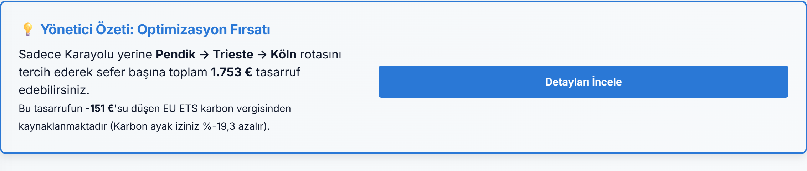
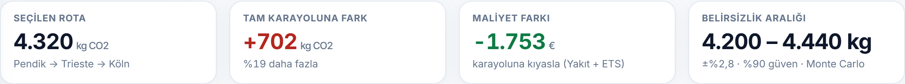

**Dış gözlem kartları** — projenin kendi varsayımının yanında, dışarıdan indirilmiş bir
ölçüm. Hiçbiri hesabın girdisi değildir; hepsi hesabın *yanında* durur.

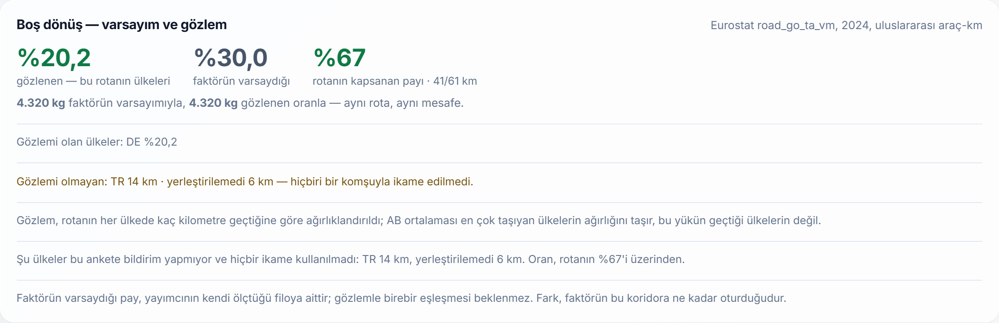

Eurostat'ın anketi bu koridorda GLEC'in varsaydığı %30 boş dönüşü doğrulamıyor: gözlenen
oran %20,2. Kartın kendisi kapsamı da söylüyor — Türkiye ve Sırbistan bu ankete bildirim
yapmıyor.

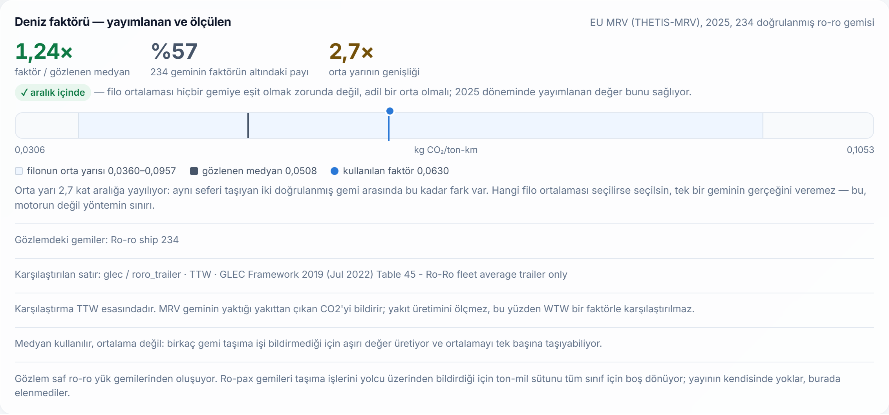

GLEC'in ro-ro faktörü, 234 doğrulanmış geminin orta yarısının içinde. Ama o orta yarı
2,7 kat aralığa yayılıyor: aynı seferi taşıyan iki gemi arasındaki fark bu kadar. Kart
bunu bir başarı olarak değil, yöntemin sınırı olarak yazıyor.

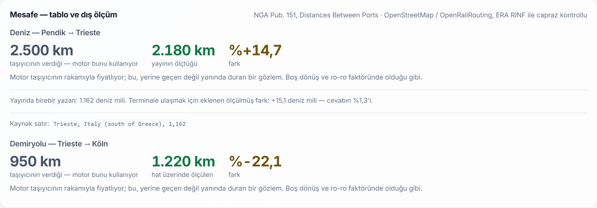

Taşıyıcının verdiği mesafeye karşı iki bağımsız ölçüm. Deniz tarafı %14,7 **yüksek**,
demiryolu tarafı %22,1 **düşük** okuyor — düzeltmeler ters yönde. Motor ikisini de
uygulamıyor; ikisini de gösteriyor.

**ISO 14083 öz değerlendirmesi** — bu rakamın neyi karşılayıp neyi karşılamadığı.

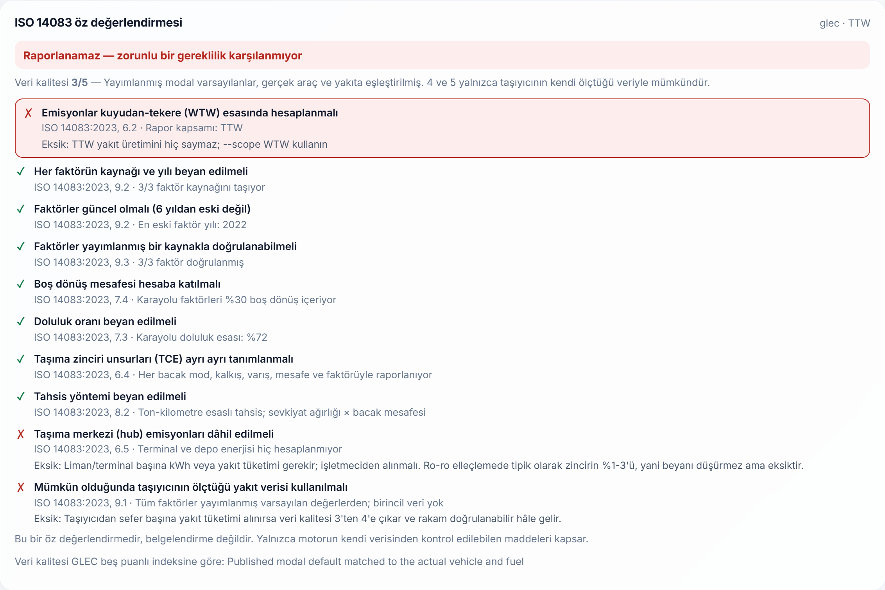

**Risk, maliyet ve süre**

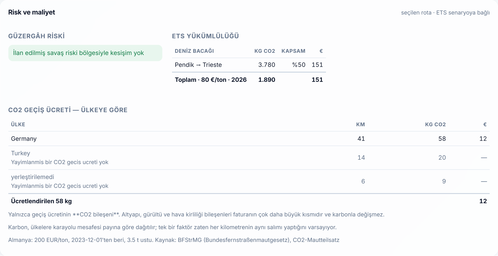
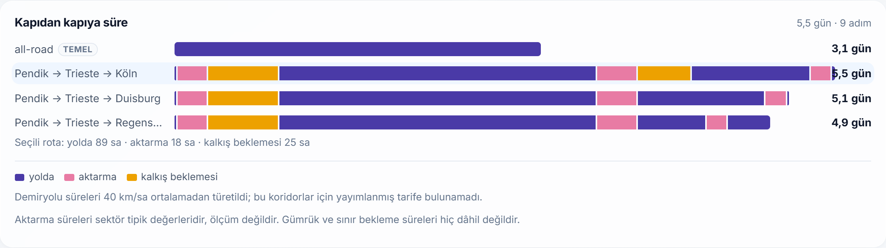

**Duyarlılık ve bacak dökümü** — sonucun hangi seçime ne kadar bağlı olduğu, ve
kilometrelerin nereden geldiği.

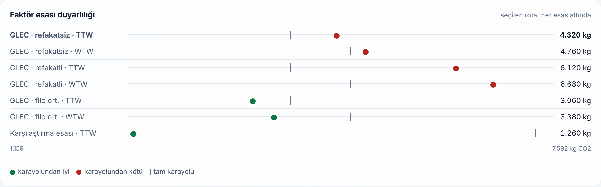
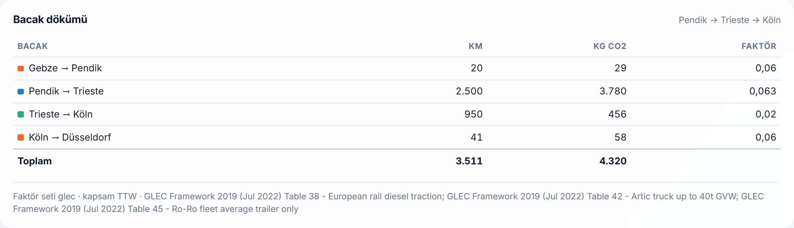

---

Pano bir sevkiyat girdisi ve onun üzerine açılan kartlardan oluşur; her kart bir soruya
cevap verir. Cevabı bir dosya yüklemeye ya da dışarıdan bir gözleme bağlı olan yedi kart
(aşağıda *dış gözlem* ve son satır) **cevap yoksa kendini gizler** — boş bir kart,
olmayan bir cevabı varmış gibi gösterir.

| Kart | Hangi soruya cevap veriyor |
|---|---|
| **Senaryo çubuğu** | Faktör esası (refakatsiz / refakatli / filo ort. / karşılaştırma esası) ve kapsam (TTW/WTW). Değiştirmek **anında** — yeniden rotalama yok |
| **KPI kartları** | Seçilen rotanın emisyonu · tam karayoluna işaretli fark · Monte Carlo belirsizlik aralığı · ro-ro esasına duyarlılık |
| **Rota + oynatıcı** | Rota çizimi ve **yolculuk oynatıcı** — emisyon zaman içinde nerede birikiyor |
| **Alternatif karşılaştırması** | Seçeneklerin moda göre yığılı emisyonu |
| **Faktör esası duyarlılığı** | Aynı rota, her faktör esası altında — noktalar tam karayolu çizgisini geçtiğinde karar değişir |
| **Bacak dökümü · Kapıdan kapıya süre** | Mesafe, süre, bekleme ve aktarma bacak bacak |
| **Risk ve maliyet** | Navlun, CO2 geçiş ücreti, EU ETS ve sapma senaryosunun faturası |
| **Boş dönüş — varsayım ve gözlem** | Faktörün varsaydığı boş dönüş, Eurostat'ın gördüğüne karşı *(dış gözlem)* |
| **Deniz faktörü — yayımlanan ve ölçülen** | Kullanılan ro-ro faktörü, EU MRV'nin doğruladığı filonun dağılımı üzerinde *(dış gözlem)* |
| **Deniz mesafesi — taşıyıcı ve yayın** | Servis tablosunun km'si, NGA Pub. 151'in ölçtüğüne karşı *(dış gözlem)* |
| **ISO 14083 öz değerlendirmesi** | Bu rakam bir denetimde ne kadar dayanır |
| **Ağ kırılganlığı** | Bir bağlantı çalışmazsa koridor ne kaybeder |
| **Konsolidasyon merkezi · Ters yük · Hat portföyü** | Yüklenen sevkiyat dosyası üzerinden: nerede toplamalı, hangi boş dönüş eşleşir, hangi hat hareket etmeye değer |

### Arayüz Göstergeleri ve Ekran Görüntüleri (Güncel)

Yüklenen ekran görüntüleri üzerinden pano üzerindeki her bir göstergenin (widget) işlevi aşağıda açıklanmıştır:

**1. Senaryo Çubuğu ve KPI (Temel Performans Göstergesi) Kartları**

Bu bölüm, seçilen rotanın toplam emisyonunu, tam karayolu alternatifine kıyasla olan farkını ve Monte Carlo belirsizlik aralığını gösterir. "Faktör esası" (refakatli/refakatsiz vb.) ve "Kapsam" (TTW/WTW) seçimleri, rotalama işlemini tekrarlamadan anında bu kartlara yansır.

**2. Rota Haritası ve Alternatif Karşılaştırması**

Rota haritası, seçilen sevkiyatın coğrafi izini harita üzerine çizer ve **yolculuk oynatıcı** (player) ile emisyonun zaman içinde nerede biriktiğini animasyonlu olarak sunar. Karşılaştırma grafiği ise alternatiflerin emisyonlarını taşıma modlarına (deniz, karayolu, demiryolu) göre bölerek karşılaştırır.

**3. Kapıdan Kapıya Süre ve Bacak Dökümü**

Gösterge, toplam süreyi hareket, terminal aktarması ve bekleme süreleri olarak ayırır. Özellikle çok modlu taşımalardaki "hareketsiz geçen" gizli süreleri (örneğin limandaki beklemeler) görünür kılar. Bacak dökümü, toplam kilometrenin modlar arasındaki dağılımını özetler.

**4. Risk, Maliyet ve Faktör Esası Duyarlılığı**

Navlun bedeli, ETS maliyetleri ve CO2 geçiş ücretlerini hesaplayarak finansal etkiyi ortaya koyar. Duyarlılık göstergesi ise rotanın farklı faktör esası senaryolarında (örneğin TTW'den WTW'ye geçildiğinde) karbon kazancının nasıl değiştiğini noktalarla belirtir.

**5. Dış Gözlem Kartları ve ISO 14083 Öz Değerlendirmesi**

Motorun teorik varsayımlarını Eurostat ve EU MRV gibi bağımsız verilerle karşılaştıran dış gözlem göstergeleridir. ISO 14083 kartı, seçilen hesaplama yönteminin bir denetimde "uygun" sayılıp sayılmayacağını ve hangi eksiklikleri barındırdığını dürüstçe değerlendirir.

Rotalama pahalı (~6 sn, yedi OSRM çağrısı), fiyatlama bedava. Bu yüzden panonun sunduğu
her senaryo **tek istekte** hesaplanır; sonrasında geçiş yapmak sunucuya hiç gitmez.

**Yer arama neden tek cevap vermiyor?** Bir adı arka planda tek noktaya çözmek, sevkiyatı
yanlış vilayete göndermenin yoludur ve fark kendini belli etmez: doğrulama setinde bir
adın iki okuması rota mesafesinde **7 puan** fark veriyordu, ikisi de ekranda gayet normal
görünüyordu. Arama bu yüzden adayları listeler, seçim kullanıcınındır.

**Manşet KPI neden "tasarruf" değil?** Bu koridorda GLEC ro-ro faktörleriyle fark negatif
çıkıyor (aşağıdaki bölüm). Manşeti "tasarruf" diye kurmak ya negatif sayıyı yanlış
çerçevede gösterir ya da kullanıcıyı yaltaklanan faktörlere iter. Onun yerine manşet
**emisyon + işaretli fark**, dördüncü kart ise bu ürünün asıl bildiği şey: cevabın
muhasebe esasına ne kadar bağlı olduğu.

| Uç | İşlev |
|---|---|
| `GET /api/terminals` | Terminal listesi; servise bağlı olmayanlar işaretli |
| `GET /api/factor-sets` | Seçilebilir faktör setleri ve her birinin deniz esası |
| `POST /api/routes` | Sevkiyat → alternatifler, emisyon, tasarruf, belirsizlik |
| `GET /api/conformance` | Seçili esasın ISO 14083 öz değerlendirmesi |
| `POST /api/portfolio` | Toplu dosya → hat portföyü ve azaltım sıralaması |
| `POST /api/report` | Toplu dosya → rapor (`output_format`: `csv`/`xlsx`/`pdf`) |
| `GET /api/places` | Yer adı → aday konumlar (tek cevap değil, liste) |
| `GET /api/risk-zones` | İlan edilmiş savaş riski bölgeleri (GeoJSON) |
| `POST /api/report/jobs` | Toplu CSV → arka plan işi (202 + iş kimliği) |
| `GET /api/report/jobs/{id}` | İşin durumu ve ilerlemesi |
| `GET /api/report/jobs/{id}/file` | Biten işin raporu |
| `POST /api/compare` | İki sefer: doğrudan ve bir boğazdan kaçınan |

### Toplu rapor

Arayüzdeki "Toplu rapor" bölümünden CSV yükleyip rapor indirebilirsiniz. Zorunlu sütunlar
`origin_lon, origin_lat, destination_lon, destination_lat`; isteğe bağlı `reference,
origin_name, destination_name, tonnage`. Örnek dosya arayüzden indirilebilir.

Yükleme **arka plan işi** olarak çalışır: soğuk bir sevkiyat ~6 saniye ve yedi OSRM
çağrısı sürdüğü için 500 satırlık bir dosya hiçbir istek zaman aşımına sığmaz. Dosya
gönderilir, iş kimliği döner, arayüz ilerlemeyi sorar (`4/25 sevkiyat (%16)`), bitince
indirir. Satırlar birbirinden bağımsız olduğu için dörder dörder işlenir — ölçüldü,
100 satırda 36,6 sn yerine 9,4 sn. Sınır **OSRM istemcisinde**, çağıranda değil:
`OSRM_MAX_CONCURRENCY` (varsayılan 4) kaç isteğin aynı anda uçtuğunu kapatır. Bu sınır
çağıran başına olsaydı, dört işlik havuz içinde dörder satır demo sunucusuna aynı anda
**16 istek** bindirirdi — ölçüldü ve test edildi. Kendi OSRM'inizde artırılabilir.

> İşler **süreç belleğinde** tutulur. Bu, brifingin stateless tercihine uygun ve
> kullanıcının birkaç dakika izlediği bir şey için veritabanı gereksiz. Ama işler yeniden
> başlatmayı atlatmaz ve ikinci bir işçi süreci onları göremez — çok işçili dağıtım için
> önce paylaşılan bir depo gerekir.

**Çıktı biçimi.** Rapor üç biçimde indirilebilir ve üçü de aynı rakamları, aynı esas
beyanıyla taşır:

| Biçim | Ne için |
|---|---|
| **Excel** (`.xlsx`) | Lojistik biriminin düzenleyip dosyaladığı hâl. Veriler bir sayfada, **esas ve kaynaklar ayrı bir sayfada** — üstbilgi satırının üstüne yazılan bir not, veri sıralanıp kopyalandığında kaybolan ilk şeydir. |
| **PDF** | Müşterinin kendi raporlamasına eklediği hâl. Yatay A4, hesap esası bloğu, uyarılar ve yöntem notu. |
| **CSV** | Veri aktarımı. |

PDF'te **Bitstream Vera** fontu gömülür (reportlab ile birlikte gelir). Sebebi: reportlab'in
yerleşik fontları Latin-1'dir ve Latin-1'de **ı, ş, ğ, İ yoktur** — Türkçe bir rapor onlarla
bozuk çıkar. Gömülü font sayesinde konteynerde sistem fontu gerekmez.

Her sevkiyat için **en düşük emisyonlu** seçenek raporlanır — bu tam karayolu da olabilir.
Rotalanamayan bir sevkiyat kendi satırında hatasıyla görünür, diğerlerini düşürmez.
Rapor dosyasının başında hangi faktör seti ve kapsamla üretildiği yazar; kaynağı
belirtilmeyen bir karbon rakamı alıcı tarafından denetlenemez.

Haritada karayolu bacakları **gerçek OSRM güzergâhı**, deniz ve demiryolu bacakları
**kesikli düz çizgi** olarak çizilir — bunlar şematiktir, ölçülmüş güzergâh değildir.

## Kullanım — komut satırı

Kalkış ve varış noktası `lon,lat` olarak verilir. Negatif boylamda `--origin=...`
biçimini kullanın (aksi hâlde argparse bunu parametre sanır).

```bash
cd backend
python -m app.cli --origin=29.4306,40.7889 --destination=6.7735,51.2277 \
                  --origin-name "Gebze" --destination-name "Dusseldorf" --tonnage 24
```

Sık kullanılan seçenekler:

| Seçenek | Ne yapar |
|---|---|
| `--tonnage` | Taşınan yük (ton), varsayılan 24 |
| `--scope` | `TTW` veya `WTW` — faktör kapsamı |
| `--fuel` | Karayolu yakıtı — `diesel_b5`, `hvo_uco`, `electric_tr` … Boş bırakılırsa setin varsayılanı. `--list-fuels` seçenekleri yazar |
| `--load-factor` | Doluluk oranı 0-1 |
| `--empty-return` | Boş dönüş payı 0-1 |
| `--load-uncertainty` | Doluluğun ne kadar altına düşebileceği |
| `--compare-computed` | Deniz bacağını searoute ile de hesaplayıp referansla karşılaştır |

## Testler

```bash
cd backend
python -m pytest tests/ -q
```

Takım **ağa çıkmaz**: `conftest.py` her testin ağ erişimini kapatır ve dışarı çıkmaya
çalışan test başarısız olur (`@pytest.mark.network` ile muaf tutulabilir; şu an hiçbiri
değil). Bu bilinçli — canlı bir servise bağlı test, geliştiricinin makinesinde geçip
CI'da rastgele kırılır, ya da daha kötüsü orada da geçip taklidinin devre dışı kaldığını
gizler. Nitekim bu koruma eklenirken Nominatim'e gerçekten istek atan bir test bulundu.

## Konteyner ve CI

```bash
docker compose up -d app          # public OSRM ile, ön işleme gerekmez -> :8100
docker compose --profile self-hosted up -d   # yukarıdaki yerel OSRM ile
```

Önbellek `/app/var` altında, **`/app/data` altında değil**. Sebebi önemli: `data/`
referans veriyi taşır (faktörler, terminaller, risk bölgeleri) ve kodla birlikte
değişir. Önbelleği orada tutmak için oraya volume bağlarsanız referans veri de sabitlenir
ve düzeltilmiş bir emisyon faktörü yeniden dağıtılan konteynere hiç ulaşmaz.
`FREIGHTPRINT_CACHE_DIR` ile taşınabilir; verilmezse yerel geliştirme için `data/` olur.

`.github/workflows/ci.yml` üç iş koşar: hassas dosya kontrolü, testler, ve imajın
kurulup `/health` cevaplaması. Sır veya dış servis gerekmez.

Gizlilik kancasını kurun — elle hatırlamak kontrol sayılmaz:

```bash
python scripts/install_hooks.py
```

## Mimari (Faz 1 kapsamı)

| Dosya | Sorumluluk |
|---|---|
| `data/terminals.geojson` | Terminal noktaları (brifing Bölüm 4.3) |
| `data/service_legs.csv` | Deniz/demiryolu servis kenarları (Bölüm 4.4) |
| `data/emission_factors.csv` | Versiyonlu faktör tablosu — kaynak, yıl, kapsam, doğrulanmış mı |
| `data/tree_factors.csv` | Ağaç eşdeğeri katsayıları |
| `backend/app/core/network.py` | NetworkX grafı, terminal yükleme, en yakın terminal |
| `backend/app/core/road.py` | OSRM sarmalayıcı — serbest karayolu bacağı, feribot ayrımı |
| `backend/app/core/sea.py` | searoute sarmalayıcı + Korint Kanalı gerçekçilik kontrolü |
| `backend/app/core/route.py` | İki nokta → çok modlu rota alternatifleri |
| `backend/app/core/emissions.py` | Faktör uygulama, tam karayolu karşılaştırması, ağaç eşdeğeri |
| `backend/app/core/uncertainty.py` | Monte Carlo belirsizlik aralığı |
| `backend/app/main.py` | FastAPI girişi, arayüzü statik olarak sunar |
| `backend/app/api/` | Pydantic şemaları ve REST uçları |
| `backend/app/core/report.py` | Toplu sevkiyat dosyası → rapor |
| `backend/app/core/risk.py` | Risk bölgesi kesişimi, geçilen boğazlar |
| `backend/app/core/cost.py` | ETS kapsamı ve sapma maliyeti |
| `backend/app/core/schedule.py` | Kapıdan kapıya süre: sürüş kuralları, aktarma, bekleme |
| `data/risk_zones.geojson` | İlan edilmiş savaş riski bölgeleri (elle sayısallaştırılmış) |
| `scripts/check_privacy.py` | Commit'e müşteri verisi sızmasını engelleyen kontrol |
| `frontend/` | Tek sayfa arayüz (MapLibre + vanilla JS, derleme adımı yok) |
| `backend/app/core/cache.py` | SQLite disk önbelleği — süreç yeniden başlasa da korunur |
| `backend/app/core/geocode.py` | Nominatim sarmalayıcı, ülke adı normalleştirme, disk önbelleği |
| `backend/app/core/validation.py` | Doğrulama veri setini okuma ve referansla karşılaştırma |
| `notebooks/validation_analysis.py` | Faz 3 analizi (defterin kaynağı) |

Rota arama, kalkış ve varış noktalarını grafa geçici düğüm olarak ekleyip k-en-kısa-yol
çalıştırır; böylece tam karayolu seçeneği doğal olarak karşılaştırma temeli hâline gelir.

## Deniz faktörünün seçimi — ro-ro, konteyner gemisi değildir

> Bu bölüm bir denetim sonucu değil. Proje brifingi (§3) sistemin "mevcut raporların
> hatasını bulan bir denetim aracı" olmadığını açıkça söylüyor; eldeki gerçek raporlar
> yalnızca **kendi hesabımızın tutarlılığını ölçmek** için kullanılıyor. Aşağıdaki
> karşılaştırma, motorun farklı faktör esasları altında nasıl davrandığını gösterir —
> herhangi bir firmanın raporu hakkında bir iddia değildir.

Ro-ro ile konteyner gemisi aynı emisyon esasına sahip değil. Ro-ro gemisi treyler taşır:
yükün yanında treylerin darasını da taşır, doluluk oranı düşüktür (%40) ve daha hızlı
seyreder. Konteyner gemisi büyüklüğündeki bir değeri (**~0,012 kg CO2/ton-km**) ro-ro
servisine uygulamak, bu yüzden esas hatasıdır — ve doğrulama veri setindeki hesaplar bu
esasla kurulmuş olduğu için bizim sayılarımızla kıyaslanabilir bir referans oluşturuyor.

GLEC Framework'ün ro-ro değerleri (Tablo 45, g CO2e/ton-km, TTW/WTW):

| Esas | TTW | WTW |
|---|---|---|
| Ortalama, sadece yük | 42 | 45 |
| **Sadece treyler** (bu sistemin varsayılanı) | **63** | **68** |
| Çekici + treyler | 93 | 100 |

Karayolu tarafında da esas farkı var: `reference` seti 0,121 taşırken GLEC'in 40 tonluk
çekicisi (konteyner esası, doluluk ve boş dönüş dâhil) **0,060**. İki fark da aynı yöne,
çok modlu taşımayı görece iyi gösterme yönüne çalışıyor.

Aynı sevkiyat, Pendik–Trieste–Köln (24 ton), üç esas altında:

| Faktör seti | Çok modlu | Tam karayolu | Fark |
|---|---|---|---|
| `reference` (karşılaştırma esası) | 1.262 kg | 7.304 kg | %83 |
| `glec` TTW | 4.324 kg | 3.622 kg | **−%19** |
| `glec` WTW | 4.760 kg | 4.527 kg | −%5 |

**Sonucun işareti, seçilen esasa bağlı.** Bu koridorda GLEC faktörleriyle çok modlu
taşıma karbon kazandırmıyor; demiryolu bacağı hâlâ net kazanç (tren 0,020'ye karşı
karayolu 0,060), fark ro-ro deniz bacağından geliyor.

Ürünün duruşu buradan çıkıyor: sistem **bir tasarruf vaat etmiyor, hangi esasla hesap
yaptığını beyan ediyor.** Her çıktıda faktör seti ve kapsam yazılı, faktör seti panoda
gizli bir varsayım değil öne çıkan bir kontrol, ve fark negatifse ağaç eşdeğeri sıfır
döner.

## Risk, maliyet ve süre

**Güzergâh riski.** Deniz bacaklarının izi searoute'tan alınıp ilan edilmiş savaş riski
bölgeleriyle kesiştirilir. Bölgeler `data/risk_zones.geojson` içinde, Joint War Committee
listesinden (JWLA-033) **elle sayısallaştırılmış basitleştirilmiş dikdörtgenler** —
kesin hukuki sınır değil, "rota bu alana giriyor mu" sorusunu cevaplamak için.

Poligonların doğruluğu iki testle sınanır: (1) bir bölge, kapsadığını iddia ettiği boğazın
gerçek koordinatını içermeli, (2) searoute bağımsız olarak "bu rota Süveyş'ten geçti"
diyorsa, iz Süveyş'i iddia eden bölgeyle kesişmeli. Bu testler yazıldığında iki yanlış
iddia yakalandı ve düzeltildi.

İzi olmayan bir deniz bacağı **"kontrol edilmedi"** olarak raporlanır, temiz sayılmaz.

**ETS maliyeti.** Şemanın gerçek coğrafi kuralı uygulanır: AEA içi seferler %100, bir ucu
dışarıda olanlar **%50**, ikisi de dışarıda olanlar kapsam dışı. Kademe: 2024 %40,
2025 %70, 2026 ve sonrası %100. Yalnızca deniz bacakları — karayolu ayrı bir şema (ETS2),
demiryolu denizcilik şemasında değil.

**Savaş risk primi hesaplanmaz.** Prim tekne değeri üzerinden pazarlıkla belirlenir ve
yayımlanmaz; kullanıcı girdisidir. Sistemin eklediği, sapmanın **hesaplanabilir** kısmı:
mesafe, süre, CO2 ve ETS farkı. Böylece armatörün faturası bir şeye karşı denetlenebilir.

**Kapıdan kapıya süre.** Mesafeden değil, üç parçadan oluşur: yolda geçen süre, terminal
aktarması ve kalkış beklemesi. Karayolunda AB sürüş kuralları uygulanır (günde 9 saat
sürüş, 4,5 saatte bir 45 dk mola, 11 saat günlük dinlenme) — bunlar olmadan Türkiye'den
Almanya'ya iki gün çıkardı. Deniz süreleri yayımlanmış tarifelerden (DFDS), yoksa
türetilir ve "tahmin" işaretlenir.

Gebze→Düsseldorf için sonuç: tam karayolu **3,1 gün**, çok modlu **5,5 gün** — ve farkın
üçte biri hiç hareket edilmeyen süre (18 sa aktarma + 25 sa bekleme).

## CO2 geçiş ücreti — karbonun faturaya döndüğü yer

Almanya 1 Aralık 2023'ten beri kamyon geçiş ücretinde karbonu fiyatlıyor: **ton başına
200 €**, yani bu motorun deniz için kullandığı tahsis fiyatının iki buçuk katı. Türkiye–
Almanya koridorunda karayolu kilometrelerinin **680'i Almanya'da**, dolayısıyla bu bir
yuvarlama kalemi değil — karbon rakamının taşıyıcının zaten aldığı bir faturaya
dönüştüğü ilk yer.

Ölçüldü, Gebze→Düsseldorf 24 t:

| Rota | CO2 geçiş ücreti |
|---|---|
| Tam karayolu | **245 €** |
| Pendik–Trieste–Köln | 15 € |

Yani GLEC karbonunda **kaybeden** çok modlu seçenek, Alman CO2 geçiş ücretinde **230 €
kazanıyor.** İki rakam yan yana durmalı; taşıyıcının kararı ikisinden birine değil,
toplamına bakar.

Bunu mümkün kılan yeni yetenek: **rotanın hangi ülkede kaç km geçtiği**
(`data/countries.geojson`, Natural Earth 50m, koridora kırpılmış). Paylar geometriden,
toplam OSRM'in gerçek mesafesinden gelir — OSRM'in sadeleştirilmiş çizgisi gerçek yoldan
%8 kısadır ve çizgiyi ölçmek Türkiye–Almanya koşusunun 200 km'sini sessizce kaybettirirdi.

**Yalnızca Almanya fiyatlanıyor** ve sebebi önemli. Avusturya (Ocak 2024) ve Çekya (Mart
2024) CO2 sınıfına göre ücretlendiriyor ama ton başına karbon fiyatı **yayınlamıyorlar**;
sınıf başına km ücreti belirliyorlar. Çarpılacak bir karbon fiyatı olmadığı için
uydurmak yerine "ücretlendirilmedi, sebebi şu" diye gösteriliyorlar — sıfır değil.

> Bu, geçiş ücretinin **yalnızca CO2 bileşenidir.** Altyapı, gürültü ve hava kirliliği
> bileşenleri Alman faturasının çok daha büyük kısmıdır ve karbonla değişmez.

## ISO 14083 öz değerlendirmesi — bu rakam denetimden geçer mi

Pano, seçili faktör esasının standarda göre nerede durduğunu gösterir. **Belgelendirme
değildir**; motorun kendi verisinden kontrol edilebilen maddeleri kapsar ve değeri
işaretlediği kutucuklarda değil, **adını koyduğu eksiklerdedir.** Yaptığı şeyleri kontrol
edip "uygun" diyen bir araç, rakamı aklayan bir araçtır.

Esas değişince karar değişir:

| Esas | Karar |
|---|---|
| `glec` / **WTW** | Beyan edilebilir, doğrulanamaz — veri kalitesi 3/5 |
| `glec` / TTW | **Raporlanamaz** — ISO kuyudan-tekere ister, TTW yakıt üretimini hiç saymaz |
| `reference` / TTW | **Raporlanamaz** — üstelik boş dönüş payı da yok |

İki eksik bu motorun kendi verisiyle **hiç kapanmaz** ve dürüst manşet budur:

- **Hub emisyonları hesaplanmıyor.** ISO terminal ve depo enerjisini ister; burada hiç
  yok. Kapatmak için işletmeciden liman başına kWh gerekir.
- **Birincil veri yok.** Her faktör yayımlanmış varsayılan. Standart, taşıyıcının kendi
  ölçtüğü yakıt verisini bunların üstünde sayar; o gelmeden veri kalitesi 3'ün üstüne
  çıkamaz (4 ve 5 yalnızca ölçülmüş veriyle mümkündür).

Değerlendirme yalnızca raporun **gerçekten kullandığı** faktörlere bakar — dizelle
fiyatlanan bir rapor, aynı sette duran ama hiç dokunulmayan HVO satırları yüzünden
düşmez.

## Hat portföyü — nerede hareket etmeye değer

Toplu rapor "bu sevkiyat ne saldı" sorusunu cevaplar. Binlerce hareketi olan bir taşıyıcı
başka bir şey sorar: **hangi hatları değiştirmeye değer, ve değiştirmek neye mal olur?**
Aynı dosyayı yükleyip "Hat portföyünü çıkar" derseniz üç şey gelir:

- **Ton-km ve yoğunluk.** Toplam, uzun ve yoğun hatları öne çıkarır; `kg/ton-km` ise
  hattın nasıl işletildiğini söyler. İkisi birlikte durur, çünkü yılda iki sevkiyat
  taşıyan bir hattın yoğunluğunu düzeltmenin karşılığı yoktur.
- **Kazancın bedeli.** İki gün uzayan transit bedelsiz değildir ve ETS faturası iki yöne
  de gidebilir; süre ve € farkı her azaltım rakamının yanında durur.
- **Dayanıklılık — bu motorun tek başına verebileceği şey.** Aynı koridor bir faktör
  esasında karbon kazandırıp diğerinde kaybettirebilir. Bir hattın avantajı **test
  edilen her esas altında** da geçerliyse "dayanıklı" sayılır; yalnız birinde geçerliyse
  denetimde tartışılacak demektir ve yanına konmaz, işaretlenir.

Rotalama pahalıdır ve sevkiyat başına bir kez yapılır; sonrasında her esas altında
fiyatlamak bedava — dayanıklılık sütununu ödenebilir kılan budur.

> Pilot veriyle çalıştırıldığında **hiçbir hat dayanıklı çıkmıyor.** Bu bir hesap hatası
> değil: GLEC'in yayınlanmış ro-ro faktörleriyle çok modlu alternatif, denetimde
> savunulabilir bir azaltım vermiyor. Ürünün duruşu da tam olarak bu.

## Korint Kanalı düzeltmesi

searoute'un ağı, Marmara/Levant → Adriyatik rotalarını **Korint Kanalı'ndan** geçiriyordu.
Hiçbir ro-ro ya da konteyner gemisi oradan geçemez: kanal tabanda 21 m genişliğinde.
Kütüphanenin `restrictions` parametresi bunu engelleyemiyor, çünkü ağı yalnızca bildiği
on üç geçidi etiketliyor ve Korint onlardan biri değil.

Uzun süre bu yüzden yalnızca **işaretleniyordu**: mesafe referans tablodan alınıyor, iz
"göstergesel" diye çiziliyordu. Ama harita yine de gemiyi karadan geçiriyor gösteriyordu.

Çözüm: kanalı ağdan **çıkarmak**. Kıstağın üzerindeki tek düğüm — `(22.947, 37.961)` —
Korint Körfezi ile Saronik Körfezi'ni birleştiren yegâne bağlantı; silindiğinde rota
gerçek yoluna, Mora'nın güneyinden Malea Burnu'nu dolanarak İyon Denizi'ne çıkıyor.

| | Pendik–Trieste |
|---|---|
| searoute, kanal açık | 2.002 km ❌ karadan geçiyor |
| **searoute, kanal kapalı** | **2.193 km** ✅ Mora'yı dolanıyor |
| Referans tablo | 2.500 km |

Düzeltilmiş iz referansa da daha yakın. Kanal kutusunu kesen rota kalmadığını üç bacakta
sınayan kalıcı bir test var; bir gün yine keserse ağın altımızdan değiştiği anlaşılır.

### Dar boğazlarda iz düzeltmesi

Kanal kapandıktan sonra ikinci bir sorun kaldı: searoute'un ağı **topolojik bir graf,
deniz haritası değil.** Kenarları 170 km'ye varan aralıklarla düz çizgiler, bu yüzden
birkaçı burunları ve boğazları kesiyordu — en kötüsü Pendik–Trieste izinin **29 km'sini
Gelibolu Yarımadası'nın üzerinden** geçiriyordu.

`data/sea_track_refinements.json` bu kenarları sudan geçen nokta zincirleriyle
değiştirir. Çanakkale, 0,01 derecelik bir su ızgarası üzerinde en kısa yol aranarak
çıkarıldı; diğerleri elle yazılıp aynı kıyı verisiyle doğrulandı.

| | kara teması |
|---|---|
| Düzeltme öncesi | 55,2 km |
| **Düzeltme sonrası** | **10,9 km** (Mersin–Trieste'de 0) |

Kalan pay Çanakkale'de: searoute'un `(26.2, 40.1)` düğümü Natural Earth kıyısına göre
~1 km karada kalıyor, boğaz ise yalnızca 4 km geniş. Bu artık rotalamayla giderilemez.
`backend/tests/fixtures/coastline.geojson` (koridora kırpılmış, sadeleştirilmiş) ile
üç bacakta kalıcı olarak sınanıyor.

## Yolculuk oynatıcı

Haritanın altındaki oynat düğmesi sevkiyatı rotası boyunca yürütür: saat ilerler, CO2
sayacı birikir, işaretçi hareket eder. Statik bir çizgi, geçiş iki gün de sürse on gün de
sürse aynı görünür; bu onu görünür kılar.

İki tasarım kararı, animasyonun dürüst kalması için:

- **Karbon, onu üreten segmente yazılır** — toplam süreye eşit dağıtılmaz. Terminalde
  bekleyen kamyon yakıt yakmaz; 18 saatlik aktarma boyunca sayacın tırmanmaya devam
  etmesi, izleyenin fark edemeyeceği bir yalan olurdu.
- **Soğutma durmaz.** Frigo seçiliyse sayaç aktarma ve bekleme saatlerinde de artar,
  çünkü kutu o saatlerde de fişte. Bu, saat bazlı reefer hesabının görünür hâli.

İşaretçi hareket ederken nabız gibi atar, durduğunda sararır ve sabitlenir. Gebze→Düsseldorf
multimodalde **131 saatin 42'si (%32) hareketsiz** geçiyor — koridorun asıl dezavantajı bu
ve bir tabloda görünmüyordu. Şematik izler (demiryolu, searoute'un Korint kısayolu)
oynatıcıda da "iz şematik" diye işaretlenir, risk bölgesine girildiğinde uyarı çıkar.

## Terminal etki alanı

Haritanın altındaki **Terminal etki alanı** düğmesi, hangi terminalin nereye hizmet
ettiğini **sürüş süresiyle** gösterir. Alışıldık daire çizimi coğrafyanın olduğu her
yerde yanlıştır: Marmara, Alpler ve Boğaz, haritada yakın duran yerleri karayoluyla
saatlerce uzağa koyar. Ölçtük — noktaların **%14'ü** düz çizgi modelinin vereceğinden
farklı terminale düşüyor.

Sonuç bir **örnek ızgarasıdır, sınır değil.** İki örnek noktası arasındaki cevap
hesaplanmadı, bu yüzden harita ölçülen aralıkta kareler çizer; düzgün bir poligon,
kimsenin hesaplamadığı bir kesinlik iddia ederdi. Aralık cevabın içinde döner.

- OSRM'in `/table` servisi kullanılır: tek istekte çok noktaya matris. Izgara bu sayede
  kırk bin rota isteği yerine birkaç yüz tablo isteği eder.
- Hiçbir servisin uğramadığı terminaller **dışarıda bırakılır** (`connected_only`).
  Ambarlı'ya sürebilirsiniz ama gemiye binemezsiniz; ona etki alanı vermek, teslim edip
  mahsur kalacağınız bir bölge çizmek olurdu.
- OSRM'in rota bulamadığı nokta (açık deniz, ada) **atanmaz** — "en az kötü" terminale
  verilmez, yoksa denizi bir terminalin rengine boyardık.
- Süre sınırının ötesi de atanmaz; haritanın tamamını "en yakın" terminale boyamak
  olmayan bir etki alanı iddia etmektir.
- İlk hesap public OSRM ile ~26 sn, sonrası önbellekten anında.

## Belirsizlik — moda göre, tek bir band değil

Emisyon aralığı Monte Carlo ile üretilir ve mesafe belirsizliği **her moda ayrı** uygulanır
(`data/distance_uncertainty.csv`). Sebebi: karayolu mesafesini OSRM ile **bağımsız olarak
kendimiz hesaplıyoruz** ve doğrulama setine göre MAPE %1,9; deniz ve demiryolu bacakları
ise referans tablodan geliyor ve tek bir bağımsız kontrolü var (searoute, n=1, %4,2).

Hepsine aynı %5'i vermek iki yönde birden yanlıştı: karayolunda band gereksiz geniş,
denizde ise sahte dar. Ölçüldü — Gebze→Düsseldorf tam karayolu bandı **%7,0'dan %2,6'ya**
indi, deniz içeren rotalar görece geniş kaldı. Karşılaştırmanın hangi tarafının daha
sağlam temelli olduğu artık görünüyor.

Her satır dayanağını taşır: neye karşı ölçüldüğü, kaç örneğe dayandığı ve **ölçüm olup
olmadığı**. Demiryolu satırı açıkça "hiç kontrol edilmedi, deniz değeri ödünç alındı"
diyor — sıfır olmayan bir yer tutucu, bulgu değil.

## Emisyon hesabı

`bacak_emisyonu = mesafe_km × ton × faktör`, faktör doluluk oranı ve boş dönüş payına göre
düzeltilir. Tam karayolu senaryosu karşılaştırma temelidir; tasarruf bu ikisinin farkıdır.

Faktörler koda gömülü değil — `data/emission_factors.csv` her satırda kaynağını, yılını,
kapsamını (TTW/WTW) ve **doğrulanmış olup olmadığını** taşır. Doğrulanmamış bir faktör
kullanıldığında çıktıya uyarı düşer.

Doğrulanmış faktör setleri:

| Set | Kapsam | Deniz esası | Kaynak |
|---|---|---|---|
| `glec` **(varsayılan)** | TTW + WTW | 0,063 refakatsiz | GLEC Framework 2019 (Tem 2022), Tablo 38/42/45 |
| `reference` | TTW | 0,012 | Müşteri raporunun kendi değerleri — yeniden üretim için |
| `glec_accompanied` | TTW + WTW | 0,093 refakatli | Çekici ve şoför de gemide |
| `glec_freight_average` | TTW + WTW | 0,042 filo ort. | Clean Shipping Index ölçümü |

**Varsayılanın `glec` olmasının iki sebebi var, ve ilki teknik.** `reference` seti yalnızca
TTW satırı taşıyor; onunla `--scope WTW` çalışmıyor. Kapsamların yarısında kırılan bir set
varsayılan olamaz. İkincisi: EU MRV'ye göre `reference` setinin 0,012'lik deniz değerinin
altında **hiçbir doğrulanmış ro-ro gemisi yok**, `glec`'in 0,063'ü ise filonun orta
yarısının içinde ([Doğrulama](#doğrulama)). Varsayılan, aracın hiç kimse seçim yapmadığında
öne sürdüğü rakamdır — dışarıdan doğrulanmamış bir esasın orada durması savunulamaz.

`reference` kaybolmadı, yeri değişti: **müşteri raporunu yeniden üretmek için adıyla
seçilen esas**. Doğrulama modülü de artık onu adıyla istiyor
([validation.py](backend/app/core/validation.py)) — varsayılana bağlı kalsaydı, ürünün
hangi standardı öne çıkardığı değiştiğinde projenin baş kanıtı da onunla kayardı.

```bash
python -m app.cli --origin=... --destination=... --factor-set glec --scope WTW
```

**Refakatli/refakatsiz seçimi sonucun işaretini değiştirir** — bu yüzden gizli bir varsayım
değil, ayrı bir faktör seti olarak açıkta duruyor.

**Varsayılan yakıt.** Bir modun birden çok yakıtı olduğunda (karayolu: dizel, HVO,
elektrik) `is_default` sütunu, yakıt belirtmeyen bir aramanın hangi satırı alacağını
söyler. Bu bir veri beyanıdır, kodda tahmin değil: sete HVO satırı eklemek, "karayolu
faktörünü ver" sorgusunun anlamını sessizce değiştiremez. Varsayılanı olmayan set
(`placeholder`) çıplak aramayı reddeder.

Bir faktör istenen sette yoksa sistem **hata verir**, başka sete düşmez. Çıktının "GLEC ile
hesaplandı" deyip bir bacağı başka yerden alması, standart iddiası taşıyan bir üründe
kabul edilemez.

### Doluluk oranı ve çift sayım

Yayınlanmış faktörler kendi doluluk varsayımlarını zaten içerir — GLEC karayolu satırı %72
doluluk ve %30 boş dönüş varsayıyor. Bu değerler `basis_load_factor` ve `basis_empty_share`
sütunlarında tutulur; `--load-factor` verdiğinizde önce yayıncının varsayımı **çıkarılır**,
sonra sizinki uygulanır. İkisi birden uygulanırsa faktör 1,8 katına çıkardı.

Hiçbir şey vermezseniz faktör yayınlandığı hâliyle kullanılır — kaynağının önerdiği budur.

### HVO — besleme stoğu sonucu belirliyor

"HVO kullanıyoruz" tek başına bir emisyon rakamı vermez. GLEC'te HVO satırı yok, o yüzden
JRC'nin RED II yolak değerlerinden (Tablo 43, AR6) GLEC dizel satırı üzerinden ölçeklendi:

| Besleme stoğu | g CO2eq/MJ | kg CO2/ton-km | Dizele oran |
|---|---|---|---|
| Atık kızartma yağı (`hvo_uco`) | 12,3 | 0,0103 | **%14** |
| Hayvansal yağ (`hvo_tallow`) | 20,2 | 0,0170 | %23 |
| Kolza (`hvo_rapeseed`) | 43,1 | 0,0362 | %48 |
| Palm, açık havuz (`hvo_palm`) | 65,2 | 0,0548 | **%73** |
| *Dizel (kıyas)* | *89,2* | *0,0750* | *%100* |

Aradaki fark **5 kat**. Palm yağından üretilmiş HVO dizelin üçte ikisinden fazlasını
salıyor — ve bu **iLUC hariç**. Tek jenerik bir "HVO" rakamı bu aralığı gizler.

Yakıt panodaki **Karayolu yakıtı** listesinden seçilir; liste faktör dosyasından üretilir,
arayüze gömülü değildir, ve türetme olan satırlar seçenekte "türetme" diye işaretlidir.
Komut satırında `--list-fuels` aynı listeyi yazar.

Besleme stoğu bilinmiyorsa `hvo` satırı DEFRA'nın jenerik değerini (17,3 g/MJ) taşır.
Bu değer JRC aralığında atık kızartma yağı ile hayvansal yağ arasına düşüyor — ağırlıklı
atık bazlı İngiltere pazarıyla tutarlı, iyi bir çapraz kontrol. Ama bilinmiyorsa
kullanın; tedarikçinize sorabileceğiniz bir sorunun cevabı bu tabloda.

### Frigo yük — saatle işler, km ile değil

Frigo yük seçildiğinde soğutmanın emisyonu **ayrı bir kalem** olarak eklenir; taşıma
rakamının içine karıştırılmaz. Sebep basit: taşıma sayısı yayınlanmış GLEC tablolarından
gelir, soğutma sayısı türetmedir, ikisini toplamak hangi yarının varsayıma dayandığını
gizlerdi.

GLEC reefer'ı yalnızca **konteyner gemisi** için ve **oran** olarak verir (Tablo 46: kuru
76'ya karşı reefer 145 g CO2e/TEU-km). Bu oran başka moda taşınamaz. Konteyner gemisinin
ton-km emisyonu düşük olduğu için soğutma ünitesi onu ikiye katlıyor gibi görünür; ro-ro'nun
emisyonu zaten bir mertebe yüksektir, aynı ünite orada küçük bir ek olur. Oranı ro-ro'ya
uygulamak ek yükü **yaklaşık dokuz kat** abartırdı.

Modlar arasında taşınabilen şey ünitenin **enerji çekişidir**, o da zamana bağlıdır. Bu
yüzden ek yük bir kez `g CO2e/ton/saat` olarak türetilir ve **kapıdan kapıya sürenin
tamamına** uygulanır — aktarmada ve kalkış beklemesinde geçen saatler dâhil, çünkü kutu o
saatlerde de fişte ve çekiyor.

Türetme zinciri `data/reefer_factors.csv` içinde açıkça yazılı: 145 − 76 = 69 g/TEU-km,
GLEC s.38'deki 10 ton/TEU ile 6,9 g/ton-km, 32 km/sa gemi hızıyla **221 g/ton/saat**. Üç
varsayım içerir ve hiçbiri bu hâliyle yayınlanmamıştır — bu yüzden satır `is_verified=no`
taşır ve arayüzde uyarı düşer.

Pratik sonucu: Gebze→Düsseldorf koridorunda multimodalin karayoluna göre cezası kuru yükte
%5 iken frigo yükte **%11'e** çıkıyor. Aradaki fark multimodalin 42,5 saatlik aktarma ve
bekleme süresi — km bazlı bir hesabın sıfır saydığı, soğutma faturasının üçte biri.

## Öne Çıkan Bulgular (Grafiksel Analiz)

Geliştirilen hesaplama motoru ve dış veri entegrasyonlarıyla tespit edilen en çarpıcı bulgular aşağıdaki grafiklerde özetlenmiştir.

### 1. Boş Dönüş Payı: Varsayım vs. Gerçeklik
Uluslararası taşımacılıkta GLEC'in varsaydığı %30 boş dönüş oranı, Eurostat'ın bağımsız gözlemine göre gerçekte **~%20** civarındadır. Karayolu taşımacılığı varsayılan faktörlerin iddia ettiğinden çok daha verimlidir.

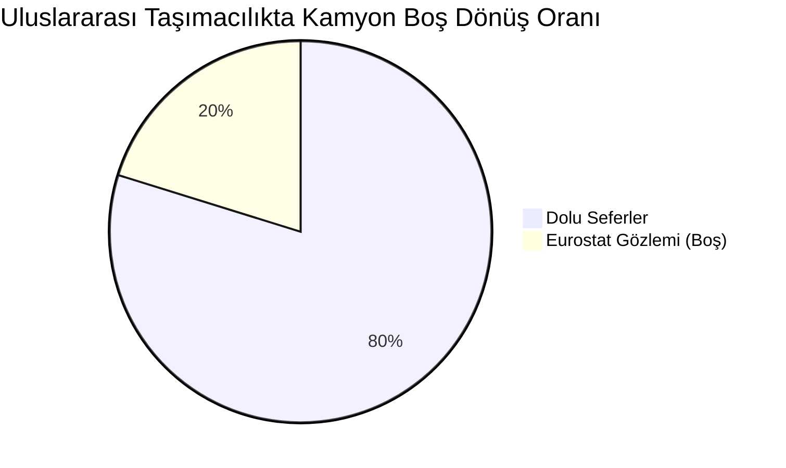

### 2. Alman CO2 Geçiş Ücretinde Çok Modlu Taşımanın Etkisi
Çok modlu taşıma, GLEC emisyon faktörleri sebebiyle TTW/WTW hesaplamasında karayoluna karşı dezavantajlı çıkabilmektedir. Ancak karayolu bacağı Avrupa'yı büyük oranda es geçtiği için Alman CO2 geçiş ücretinden **dev bir maliyet avantajı** sağlar. Karar verici için asıl fayda karbon sertifikasında değil, doğrudan navlun faturasındadır.

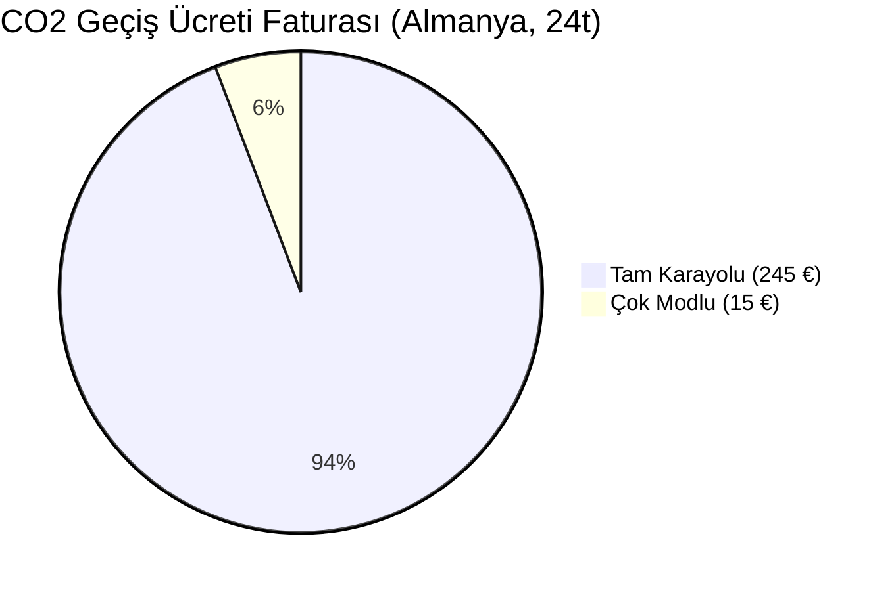

### 3. Emisyon Esasına Göre Karbon Çıktısı (Pendik–Trieste–Köln)
Ro-Ro faktörleri ile yapılan hesap (GLEC TTW/WTW) ile Konteyner Gemisi varsayımıyla (Reference) yapılan hesap arasındaki uçurum. Gerçek bir Ro-Ro gemisi, referans hesabındaki 0.012 kg CO2 faktörünün çok uzağında kalmaktadır ve bu durum çok modlu taşımanın karbon tasarrufu denklemini tamamen değiştirmektedir.

```mermaid
gantt
    title Emisyon Esasına Göre Karbon Çıktısı (kg CO2)
    dateFormat X
    axisFormat %s
    section Tam Karayolu
    Referans       (7304) :0, 7304
    GLEC WTW       (4527) :0, 4527
    GLEC TTW       (3622) :0, 3622
    section Çok Modlu
    Referans       (1262) :0, 1262
    GLEC WTW       (4760) :0, 4760
    GLEC TTW       (4324) :0, 4324
```

## Doğrulama

Bir modeli kendi varsayımıyla doğrulamak doğrulama değildir. Burada iki ayrı sınama var
ve ikisi de dışarıdan geliyor: motorun gerçek bir raporu **yeniden üretmesi**, ve motorun
varsayımlarının **bağımsız gözlemlerle karşılaştırılması**.

### 1. Gerçek bir karbon raporunu yeniden üretmek

Sistem, gerçek bir lojistik firmasının iki müşteri için hazırladığı karbon raporlarındaki
34 sevkiyatla karşılaştırıldı. Veri seti gerçek müşteri bilgisi içerdiği için depoda
**yoktur**; doğrulama testleri veri yoksa kendini atlar.

| Ölçüt | Hedef | Sonuç | Kapsam |
|---|---|---|---|
| Emisyon tutarlılığı — tam karayolu | fark < %1 | **34/34 satır**, hata ≈ 0 | 34/34 |
| Emisyon tutarlılığı — çok modlu | fark < %1 | **19/22 satır**, eşleşenlerde hata = 0 | 22/22 |
| Karayolu mesafe sapması | raporlanabilir | MAPE **%1,9**, 30/30 satır %10 içinde | 30/34 |
| Deniz referans tutarlılığı | raporlanabilir | medyan %0, MAPE %1,1, kuyruk %8,8 | 19 bacak |
| Deniz mesafe sapması | raporlanabilir | temiz %4,2 — Korint geçen %21,9 | n=1 / n=5 |

Eşleşmeyen üç satır, kendi bildirdiği km sütunlarının ürettiğinden **daha düşük** bir CO2
raporluyor. Farkın karayolu bacağından geldiği yorumu tutarlıdır ama yalnız bu veriyle
kanıtlanamaz; kesin olan, kaynak raporun kendi içinde tutarsız olduğudur.

**Bu sonuçların kabul edilmiş sınırları:**

- Karayolu metriği 34 satırın 30'unu kapsıyor. Dört varış noktası coğrafi kodlanamadı,
  çünkü posta kodları kaynak veride eksik ya da hatalı yazılmış (biri gereken hane
  sayısından kısa, biri harf eki eksik, biri CEDEX kodu). Yanlış bir konuma zorlamak
  yerine çözümsüz bırakıldı.
- Bir varış noktasının adı ülkesinde birden fazla yerleşime karşılık geliyor. Seçilen
  aday −%3,3 sapma verir; diğer aday −%10,3 verir ve %10 ifadesini kırar. Hangisinin
  kastedildiği kaynak veriden anlaşılmıyor.
- Korint karşılaştırmasının kontrol grubu **tek bacak**. O bacak aynı zamanda ağdaki tek
  Adriyatik-içi bağlantı olduğundan "kanaldan geçiyor" ile "Doğu Akdeniz çıkışlı"
  değişkenleri ayrılamıyor. Tablo işaret eder, kanıtlamaz — kanıt Faz 0'daki doğrudan
  gözlemdir (rota koordinatları kanalın üzerinden geçiyor).

Analizi yeniden üretmek için:

```bash
python notebooks/build_notebook.py   # betikten defteri üret
jupyter notebook notebooks/validation_analysis.ipynb
```

Defter **çıktısız** işlenir: çalıştırıldığında grafikleri ve sayıları yerelde üretir,
ama sonuçlar depoya yazılmaz. Defterin metninde açıklama amaçlı birkaç örnek servis
rotası ve mesafe geçer; sevkiyat satırları, müşteri adları ve tonajlar geçmez.

### 2. Motorun varsayımlarını dışarıdan gözleme karşı tutmak

Yukarıdaki tablo tek bir şeyi kanıtlıyor: motor, kendisine verilen faktörlerle doğru
aritmetik yapıyor. **Faktörlerin kendisinin bu koridoru tarif edip etmediğini
kanıtlamıyor.** Bunun için kaynağı bu proje olmayan veri gerekiyor; `data/external/`
klasöründeki dosyalar indirilmiştir, üretilmemiştir ve hiçbiri hesabın girdisi değildir —
yalnızca hesabın sınandığı ölçüttür. Türetme betikleri `scripts/` altında.

| Varsayım | Gözlem | Sonuç |
|---|---|---|
| GLEC karayolu faktörü **%30 boş dönüş** varsayıyor | Eurostat `road_go_ta_vm`, 29 ülke, 2022–2024 | Uluslararası AB taşımacılığında **~%12**. Faktörün esası bu koridorun trafiği değil |
| GLEC ro-ro faktörü **0,063** (TTW) | EU MRV / THETIS-MRV, 684 gemi-yılı, doğrulayıcı onaylı | Filonun **orta yarısının içinde**, üç dönemin üçünde de. Manşetin dayandığı sayı için söylenebilecek en güçlü şey |
| `reference` setinin deniz değeri **0,012** | Aynı kaynak, 234 gemi | Filodaki **hiçbir gemi** o kadar temiz değil (medyanın 0,24 katı) |
| Deniz **mesafesi** taşıyıcının verdiği rakam | NGA Pub. 151, *Distances Between Ports* | Altı bacağın altısında da servis tablosu **%9–26 yüksek** |

**Boş dönüş — ve bunun manşete etkisi.** Koridor kendi kilometreleriyle
ağırlıklandırıldığında gözlenen oran **%17,4**, kapsam **%70** (Sırbistan ve Türkiye bu
ankete bildirim yapmıyor; 754 km gözlemsiz ve hiçbiri komşusuyla ikame edilmedi). Aynı
rotayı gözlenen oranla yeniden fiyatlamak çok modlu cezayı **+%5,1'den +%21,9'a**
taşıyor — yani bulguyu zayıflatmıyor, güçlendiriyor. Kapsamı söylenmeyen bir ağırlıklı
ortalama, kontrol edilene kadar doğru görünen türden bir sayıdır; bu yüzden oran
kapsamsız hiç dolaşmıyor.

**Deniz faktörü — geçen sınav ve asıl bulgu.** 0,063 her dönemde orta yarının içine
düşüyor (medyanın 1,07× / 1,17× / 1,24× katı). Filo ortalamasının hiçbir gemiye eşit
olması beklenmez, adil bir orta olması beklenir. Ama **orta yarının kendisi 2,7 kat
aralığa yayılıyor**: aynı seferi taşıyan iki doğrulanmış gemi arasında bu kadar fark var.
Hangi filo ortalaması seçilirse seçilsin tek bir geminin gerçeğini veremez — bu, motorun
değil yöntemin sınırı ve pano bunu rakamla birlikte gösteriyor.

**Türetmeler denetlenebilir.** Her iki gözlem de ham hâliyle depoda duruyor ve
türetmeleri betiklerden ibaret — bir defalık elle yapılmış bir adım değil:

```bash
python scripts/import_eurostat.py --check   # islenmis CSV hala ham yanittan mi geliyor
python scripts/import_mrv.py "data/external/<dosya>.xlsx" --describe
```

Eurostat türetmesi ağa çıkmaz (indirme ayrı bir adımdır, yoksa yanıtı depoda tutmanın
anlamı kalmaz) ve `--check` test takımında koşar. THETIS-MRV çalışma kitabı elle
indirilir; portal bir JavaScript uygulaması, dışa aktarma reCAPTCHA arkasında ve EMSA
doğrudan dosya adresi yayımlamıyor — betik bunu gizlemek yerine yazıyor.

**Deniz mesafesi — en büyük kaldıraç, en geç gelen hakem.** Bu koridorun emisyonunun
%87,4'ü deniz bacağından geliyor ve mesafesinin bağımsız kontrolü tek bir searoute
karşılaştırmasıydı. NGA Pub. 151 altı bacağın altısını da ölçüyor ve altısında da servis
tablosu yüksek çıkıyor (%9,4–26,1). Yayın ayrıca Korint Kanalı rotasını ayrı yayımlıyor —
ro-ro geçemediği için doğru karşılaştırma "Yunanistan'ın güneyinden".

**Düzeltme bilinçli olarak uygulanmadı.** Motor taşıyıcının rakamıyla fiyatlamaya devam
ediyor, Pub 151 panoda yanında duruyor — tıpkı boş dönüşte ve ro-ro faktöründe olduğu
gibi. Bu projenin bütün dış doğrulamaları aynı desende çalışır: varsayımı sessizce
değiştirmez, neye dayandığını söyler. Uygulansaydı multimodal ceza +%19,4'ten +%7,3'e
inerdi; bulgu ayakta kalır ama üçte birine düşerdi.

Ayrıntı, kaynak künyeleri ve gözlemin **yapamadıkları**:
[`data/external/README.md`](data/external/README.md).

## Bilinen sınırlar

- **Deniz mesafesi hâlâ referans tablodan alınır.** Korint sorunu çözüldükten sonra
  searoute'un kendi mesafesi (Pendik–Trieste 2.193 km) referansa (2.500 km) yaklaştı ama
  eşitlenmedi; hangisinin doğru olduğunu ayırt edecek üçüncü bir kaynak yok, bu yüzden
  esas hâlâ referanstır ve searoute karşılaştırma için hesaplanır.
- **Demiryolu mesafeleri yalnızca referans tablodan gelir.** TEN-T/OpenRailwayMap
  entegrasyonu henüz yok, bu yüzden demiryolu bacağı hesaplanmıyor.
- **Karayolu için public OSRM demo sunucusu kullanılıyor.** Hız sınırlı; prodüksiyon
  için `OSRM_BASE_URL` ortam değişkeniyle kendi OSRM örneğinizi gösterin.
- **CLI geocoding kullanmaz.** Komut satırında koordinat girilmesi gerekiyor; arama
  yalnızca web arayüzünde var.
- **Referans mesafeler kendi aralarında çelişiyor.** `data/service_legs.csv` Pendik–Bari
  için 1755 km diyor, doğrulama veri seti aynı bacak için 1825 km. Hangisinin doğru
  olduğu henüz belirlenmedi — kendi deniz mesafemizi hesaplamadan hakem yok.
- **Ambarlı hiçbir servise bağlı değil.** Brifingde terminal olarak listeli ama servis
  bacağı yok, dolayısıyla rotalamaya hiç girmiyor. Bir test bunu görünür tutuyor.
- **Demiryolu transit süreleri türetilmiş.** Bu koridorlar için yayımlanmış tarife
  bulunamadı; 40 km/sa ortalamadan hesaplanıyor ve çıktıda "tahmin" olarak işaretli.
- **Aktarma süreleri sektör tipik değerleri**, ölçüm değil. Gümrük ve sınır kapısı
  bekleme süreleri hiç dâhil değil — gerçek kapıdan kapıya süre daha uzun olabilir.
- **`reference` seti WTW desteklemez.** Müşteri raporu yalnızca TTW değerleri verdiği için
  `--scope WTW` bu setle çalışmaz. Varsayılan `glec` olduğundan bu artık kimseyi kazara
  vurmuyor; `reference`'ı adıyla seçen biri TTW'de kalmak zorunda.
- **Demiryolu için dizel çekiş varsayılıyor.** GLEC'in dizel satırı hem TTW hem WTW verdiği
  için tutarlı bir çift oluşturuyor. Trieste–Köln gibi elektrikli koridorlarda gerçek değer
  0,0091 WTW, yani mevcut varsayım muhafazakâr (yüksek) yönde.
- **HVO ve elektrik faktörleri türetme.** GLEC'te bu satırlar yok; DEFRA, JRC ve şebeke
  yoğunluklarından GLEC dizel satırı üzerinden ölçeklendi ve `is_verified=no` taşıyorlar.
- **HVO satırları dolaylı arazi kullanımını (iLUC) içermez.** RED II Ek VIII bunu bitkisel
  kökenli yakıtlara ekliyor ve kazancı silecek büyüklükte; değeri yetkili kaynaktan
  doğrulayamadığım için eklenmedi, her satır dışlandığını yazıyor.
- **Gözlem, koridorun tamamını görmüyor.** Eurostat'ın boş dönüş anketine Türkiye ve
  Sırbistan bildirim yapmıyor; pilot koridorun 2.515 karayolu kilometresinin 754'ü (%30)
  gözlemsiz. Eksik ülke için komşusu ikame **edilmiyor**; oran kapsamıyla birlikte
  dönüyor ve kapsam %66,7'nin altına düşerse duyarlılık yeniden fiyatlaması hiç
  üretilmiyor.
- **Deniz gözleminde tek bir ro-pax gemisi yok** — filtre değil, yayının kendisi. MRV
  ro-pax'ın taşıma işini yolcu üzerinden ölçtüğü için 415 ro-pax ve 67 konteyner/ro-ro
  gemisinin tamamı kütle esaslı ton-mil bildirmiyor. Sonuç: GLEC'in **refakatli** satırı
  (0,093) ağırlıkla ro-pax'ta seyreden bir trafiği tarif ediyor, yani bu gözlemin
  içermediği bir trafiği. Karşılaştırma yine gösterilir ama `is_comparable=False` ile
  işaretlidir ve bir sınama sayılmaz.
- **Hiçbir filo ortalaması tek bir gemiyi tarif edemiyor.** Doğrulanmış filonun orta
  yarısı 2,7 kat aralığa yayılıyor. Motorun deniz rakamı bu yüzden bir sefer tahmini
  değil, bir filo tahminidir — ve pano bunu gizlemek yerine yayılımı rakamla veriyor.
- **Deniz ve demiryolu belirsizliği ölçüm değil.** Deniz bandı tek bir bağımsız
  karşılaştırmaya (searoute, n=1) dayanıyor; demiryolu hiç kontrol edilmedi ve deniz
  değerini ödünç alıyor. `data/distance_uncertainty.csv` her satırda bunu yazıyor.

## Geliştirme Yol Haritası (Eleştirilere Çözümler)

Projenin jüriler ve kullanıcılar tarafından belirtilen eksikliklerini ve bilinen sınırlarını çözmek için planlanan teknik yol haritası:

### 🟢 Hızlı Kazanımlar (1-2 Haftalık İşler)
1. **Hub (Liman) Emisyonlarının Eklenmesi:** `data/terminals.geojson` dosyasına her terminal için `kwh_per_ton` veya eşdeğeri bir emisyon sabiti eklenip ISO 14083 eksikliğinin giderilmesi.
2. **Çok Dilli Destek (İngilizce Rapor):** PDF Raporlama modülüne (`report.py`) ve arayüze dil seçeneği eklenerek uluslararası müşteriler için İngilizce çıktı alınabilmesi.
3. **Deniz Mesafesi Düzeltmesi (Pub 151 Entegrasyonu):** Arayüze "Mesafeyi Pub 151'den (bağımsız referans) al" seçeneği eklenerek hesaplamanın alternatif olarak doğrulanmış mesafe ile de yapılabilmesi.

### 🟡 Orta Vadeli Çözümler (1-2 Aylık İşler)
4. **Birincil Veri Girişi:** API'ye kullanıcının *kendi ölçtüğü* gerçek yakıt tüketim verisini (primary data) girebileceği bir parametre eklenmesi, böylece ISO 14083 veri kalitesi skorunun 4/5 seviyesine çıkabilmesi.
5. **API'nin Mikroservislere Bölünmesi:** Her şeyi tek seferde yapan monolitik `POST /api/routes` yapısının `/route`, `/emissions` ve `/cost` gibi ayrı ve bağımsız servislere bölünmesi.
6. **Demiryolu Rotalaması:** Demiryolu mesafesinin statik tablodan alınması yerine, OpenRailwayMap gibi bir ağ tabanlı sistem ile dinamik olarak hesaplanması.

### 🔴 Büyük Mimari Değişiklikler (Uzun Dönem)
7. **Küresel Ölçek:** Terminallerin küresel UN/LOCODE veritabanından, servis bacaklarının ise dış sağlayıcıların (Maersk, Xeneta vb.) API'lerinden dinamik çekilerek sistemin tüm dünyaya açılması.
8. **Frontend Mimarisinin Yeniden Yazılması:** Mevcut 150 KB'lık tek parça vanilla JS (app.js) yapısının bırakılarak React, Vue veya Svelte gibi modern, bakımı kolay bir framework'e geçilmesi.
9. **Gerçek Zamanlı Veri Entegrasyonu:** Statik navlun tahminleri ve aktarma süreleri yerine; canlı AIS gemi takip verilerinin, liman yoğunluklarının ve piyasa spot oranlarının entegre edilmesi.

## Kesin Emin Olduklarımız (Kanıtlanmış Doğrular)

Projenin literatürle uyumlu olan, saha verisiyle kanıtlanmış ve doğruluğundan %100 emin olduğumuz en güçlü temelleri şunlardır:

1. **Aritmetik ve Rapor Doğruluğu:** Gerçek bir firmanın hazırladığı 34 sevkiyatlık müşteri raporuyla test edildi. Karayolu emisyonlarında 34/34 satırda hata payı neredeyse sıfırdır.
2. **Ro-Ro ve Konteyner Gemisi Ayrımı:** GLEC Framework ve ISO 14083 kurallarına tam uyumludur. Sektörde sıkça yapılan "Ro-Ro'ya konteyner faktörü (0.012) uygulama" hatası reddedilmiş ve bunun yerine 0.063'lük doğru Ro-Ro faktörü kullanılmıştır.
3. **AB MRV Verisiyle Çapraz Doğrulama:** Seçilen 0.063'lük Ro-Ro faktörünün, Avrupa Birliği'nin yayımladığı 684 gemi-yıllık gerçek ölçüm (THETIS-MRV) verisinde "filonun orta yarısına" düştüğü kanıtlanmıştır. Ayrıca 0.012'lik değere inebilen hiçbir Ro-Ro gemisinin olmadığı resmi verilerle ispatlanmıştır.
4. **Boş Dönüş Oranı Eleştirisi:** GLEC'in karayolu için önerdiği %30 boş dönüş payının, Eurostat'ın güncel anket verilerine göre uluslararası AB taşımacılığında aslında ~%12 civarında olduğu veriyle ortaya konmuştur.
5. **Karayolu Mesafe Hesabı (OSRM):** Mesafeler statik taşıyıcı beyanlarına değil, açık kaynaklı OSRM (Open Source Routing Machine) harita motoruna dayanır. Gerçek raporlarla karşılaştırıldığında hata payı ortalama sadece %1.9'dur (MAPE).
6. **Doluluk Oranı Çift Sayım Koruması:** GLEC faktörlerinin içinde zaten belirli bir doluluk oranı vardır. Sisteme yeni doluluk girildiğinde, sistem önce eski doluluğu denklemden çıkarır, sonra yenisini uygular. Böylece çift sayım matematiksel olarak engellenmiştir.
7. **CO2 Geçiş Ücreti Maut:** Almanya'da Aralık 2023'te yürürlüğe giren ton CO2 başına 200 Euro'ya varan Maut ücreti, rotanın Almanya içinden geçen kilometrelerine (geometrik kesişimle) tam olarak yansıtılmaktadır.
